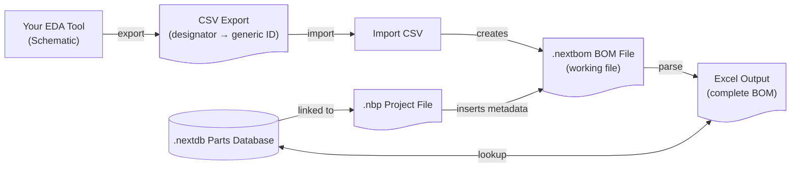

# nextbom

**nextbom** is a desktop application for creating Bills of Materials (BOMs) for electronic projects.

## Core Concept

nextbom separates two concerns that are often tangled together: **design** and **procurement**.

In a typical workflow, a schematic assigns a generic identifier to each component — something like `CAP00100` or `RES00001`. nextbom takes these generic IDs and resolves them to actual manufacturer part numbers from a separate database at BOM generation time.

This means:

- **Changing a manufacturer** does not require touching the schematic or redesigning the board.
- **Project-specific alternatives** can be maintained alongside the main parts database.
- **Multiple design variants** (e.g. a full and a lite assembly) are tracked as first-class concepts.

## What You Can Do Today

- Create and manage projects with title, engineer, and project-specifics metadata
- Import a semicolon-delimited CSV from your EDA tool to load component designators and part IDs
- Generate a `.nextbom` BOM file from the imported CSV
- Save and reopen projects (`.nbp` files), with recent projects tracked automatically

## How It Fits Together

When you generate BOM output, nextbom reads the `.nextbom` working file (designators and their generic part IDs) and resolves each generic ID through the linked `.nextdb` parts database to get the manufacturer part number.

## Getting Started

1. Launch nextbom.
2. [Create a project](project.md) — give it a title, and optionally an engineer name.
3. [Link your project to a `.nextdb` parts database](project.md#linking-the-parts-database).
4. [Import your BOM CSV](workflow.md#import-csv) from your schematic tool.
5. [Create a nextbom BOM file](workflow.md#create-bom-file) from the imported data.
